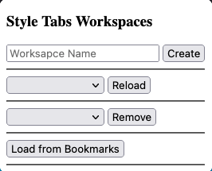

# TST Workspaces

### Create
Create a new workspace with the given name or overrite an existing one.
- Will be split into two functions in the future.

### Reload
Select workspace to load in a new window from existing saved ones.

### Remove
Removes the selected workspace from the storage and bookmarks.
Permant change, no way to undo.

### Load from Bookmarks
Load saved workspaces from bookmarks folder. Useful for when readding the extension after
removing it.

## License
[MIT License](https://opensource.org/licenses/MIT)
